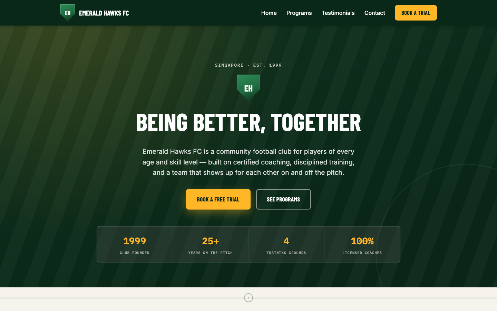

# Austcham Paddle Club Singapore

A single-page marketing site for Austcham Paddle Club, one of Singapore's longest-established dragon boat and outrigger canoe clubs, built with plain HTML, CSS, and JavaScript — no frameworks, no build step, no dependencies.

**Live site:** https://mybluecoffeecup-ops.github.io/test2/



> Note: the screenshot above still shows the previous football-themed design and needs to be retaken against the current page.

## Features

- Sticky, responsive navbar with a mobile hamburger menu
- Full-bleed hero with an animated waterline — drifting SVG wave layers and a bobbing fleet of dragon boat / outrigger silhouettes (respects `prefers-reduced-motion`)
- "Our Mighty Crew" showcase with the club team photo, a cursor-following spotlight, scroll parallax, and club stats that count up on scroll
- "Pick Your Paddle Style" activities section — Dragon Boat, Outrigger Canoe, Single Crafts, and Land & Socials as media tiles with image headers and a subtle tilt-on-hover interaction
- Why Austcham section highlighting the club's history (est. 1988) and 2024 IDBF Club Crew World Championships grand final result
- "Our Latest Races" scroll-driven 3D fly-through — race cards travel toward the viewer as you scroll a pinned stage, with a static grid fallback for `prefers-reduced-motion`
- SDBA–AustCham 10km Challenge event banner
- Testimonials grid with real Google reviews and scroll-triggered fade-in animations
- Membership ("Pick Your Lane") section with a benefits bullet list, four pricing "lanes" (annual/quarterly, full/affiliate), student pricing, and a three-step how-to-join strip
- Weekly training-times grid covering outrigger (Sentosa), dragon boat (Kallang), and land sessions
- Newbie FAQ accordion (native `<details>`/`<summary>`) with a what-to-bring checklist
- Enquiry form with client-side validation (name, email, phone), accessible inline error messages, live submission via [FormSubmit](https://formsubmit.co/), and a confetti + voice-message celebration on success
- Floating WhatsApp chat widget (bottom-right) with suggested quick-reply questions and deep links to `wa.me`
- SEO metadata: descriptive title/description, Open Graph & Twitter cards, canonical URL, and JSON-LD structured data
- Footer with contact details, quick links, social links, and an auto-updating copyright year

## Getting started

There's nothing to install or build. Clone the repo and open the file directly in a browser:

```bash
git clone https://github.com/mybluecoffeecup-ops/test2.git
cd test2
open index.html
```

## Project structure

```
index.html   # entire site: HTML structure, inline <style>, inline <script>
Pictures/    # image assets referenced by the page (club team photo, boat silhouettes)
```

Everything lives in one file, organized into three layers: HTML markup, a single `<style>` block, and a single `<script>` block at the end of `<body>`. See [CLAUDE.md](CLAUDE.md) for a full architecture breakdown.

## Deployment

Pushes to `main` automatically deploy to GitHub Pages via the workflow at [.github/workflows/deploy-pages.yml](.github/workflows/deploy-pages.yml).
